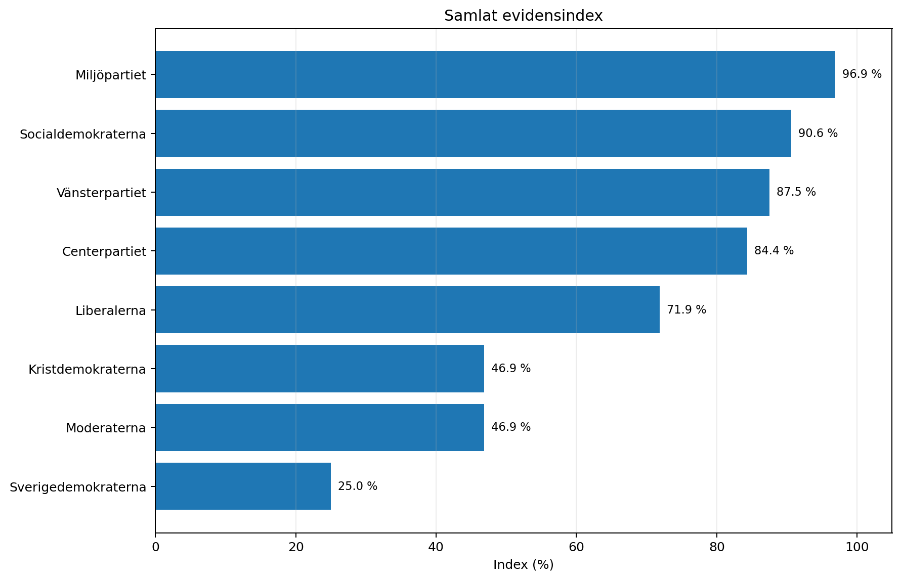
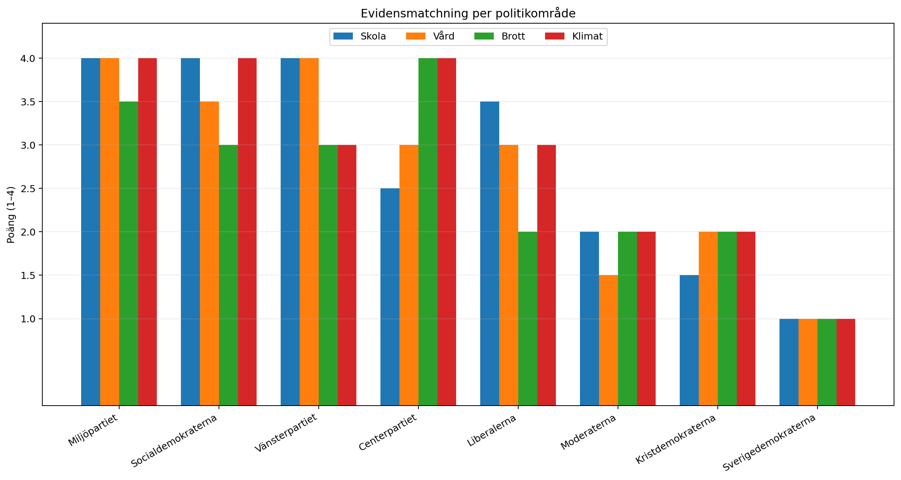

# Evidensgranskning

## Svenska riksdagspartiers politik inför valet 2026

**Skola · sjukvård · brott · klimat**  
**Version 3.0 – reviderad evidens- och mekanismanalys**  
**7 september 2026**

Version 4.0 ersätter Version 3.0. 

---

## 1. Utgångspunkt och metod

Vetenskap kan bedöma effekter, mekanismer, osäkerhet och överförbarhet. Den kan inte själv bestämma vilket politiskt mål som bör prioriteras. Därför redovisas måttstockarna öppet och hålls isär från effektforskningen.

- **Vård:** behovsstyrning och medicinskt motiverad vård används som huvudmått. Tillgänglighet och kötid redovisas separat eftersom de kan förbättras även när fördelningen efter behov försämras.
- **Skola:** externt verifierad kunskap, likvärdig mätning, tidigt stöd och lika möjligheter används som huvudmått. Särskild vikt läggs vid om konkurrenssignalerna faktiskt motsvarar kunskap.
- **Brott:** empirisk brottsminskning och återfall är huvudutfall. Proportionalitet, vedergällning och symboliskt straffvärde är normativa mål och poängsätts inte som effekt.
- **Klimat:** faktiska utsläppsminskningar, hastighet, kostnad och svensk systemrelevans vägs samman. 2030-nytta skiljs från 2050-systemrobusthet.

### 1.1 Fyra evidensnivåer

| Mekanism / utfall | Evidenstyp | Huvudresultat | Säkerhet i denna rapport |
|---|---|---|---|
| Direkt kausal effekt | RCT eller stark kvasiexperimentell design | Åtgärden kan med relativt hög trovärdighet kopplas till utfallet. | Hög |
| Justerad utfallsevidens | Register/regression med omfattande kontroller | Stark association efter kontroll, men kvarvarande selektion kan inte helt uteslutas. | Måttlig–hög |
| Mekanismevidens | Observationsstudier, myndighetsanalyser, institutionell design | Visar incitament eller fördelningsmönster, men inte alltid slutlig kausal effekt. | Måttlig |
| Scenario-/modellevidens | Systemmodeller och scenarier | Relevant för långsiktiga systemfrågor men känslig för antaganden. | Måttlig, scenario-beroende |

**Ingen falsk precision.** Rapporten använder breda evidensband i stället för decimalpoäng. Små skillnader mellan partier ska inte presenteras som om de vore statistiskt säkerställda.

**Partipositionerna är det osäkraste lagret.** De bygger på det 2026-material som låg till grund för Version 2.0 och bör kontrolleras mot slutliga valmanifest före publicering.

### 1.2 Så konstruerades evidensbanden

Evidensbanden är **inte numeriska poäng eller medelvärden**. De är en strukturerad klassificering av hur väl ett partis förslag matchar de definierade utfallen och de empiriskt belagda mekanismerna inom respektive område. Syftet är att göra bedömningen spårbar utan att skapa falsk precision.

Bedömningen gjordes i följande ordning:

1. **Definiera utfallet.** För varje politikområde fastställs först vilket utfall som bedöms. Dessa måttstockar är normativa val och redovisas öppet i avsnitt 1.
2. **Identifiera relevanta mekanismer.** Forskningen används för att identifiera vilka mekanismer som påverkar det definierade utfallet, till exempel extern betygsvaliditet i skolan, kontinuitet i primärvården, upptäcktsrisk i kriminalpolitiken eller utsläppsminskning till 2030 i klimatpolitiken.
3. **Klassificera evidensstyrkan.** Varje central mekanism placeras i en av rapportens fyra evidensnivåer: direkt kausal effekt, justerad utfallsevidens, mekanismevidens eller scenario-/modellevidens.
4. **Fastställ partiets faktiska förslag.** Partikällor används enbart för att dokumentera vad partiet föreslår. Forsknings- och myndighetskällor används för att bedöma effekter och mekanismer.
5. **Bedöm riktningen.** För varje relevant förslag bedöms om det förstärker, motverkar eller inte tydligt påverkar den empiriskt identifierade mekanismen.
6. **Bedöm direkthet och täckning.** Ett förslag som direkt träffar en starkt belagd mekanism väger tyngre än ett indirekt förslag. Ett paket som täcker flera centrala mekanismer bedöms starkare än ett paket som endast träffar en perifer del.
7. **Beakta motverkande komponenter och osäkerhet.** Om ett partis paket innehåller både evidensstödda och evidenssvaga eller motverkande delar sänks den samlade matchningen. Detsamma gäller när evidensen har låg överförbarhet till Sverige eller när effekten endast stöds indirekt.
8. **Tilldela ett brett band.** Den samlade bedömningen uttrycks som Stark, God, Blandad eller Svag matchning. Mellanformer som God–stark eller Blandad–svag används när bedömningen ligger mellan två band.

#### Beslutsregel för banden

| Band | Operativ betydelse |
|---|---|
| **Stark** | Huvudförslagen träffar en eller flera centrala mekanismer i rätt riktning, och dessa mekanismer har relativt stark evidens. Paketet innehåller inga större motverkande komponenter för det definierade utfallet. |
| **God** | Förslagen ligger huvudsakligen i evidensens riktning, men stödet är mer indirekt, mindre komplett, svagare överförbart eller riktat mot en mindre central mekanism. |
| **Blandad** | Paketet innehåller både tydligt evidensstödda och svagt stödda eller motverkande komponenter, så att den samlade riktningen inte är entydig. |
| **Svag** | Huvudmekanismen i paketet har svagt stöd för det definierade utfallet, ligger i motsatt riktning mot den samlade evidensen eller lämnar de centrala belagda mekanismerna i stort sett obehandlade. |

**Ingen automatisk sammanräkning när bandet sätts.** Ett parti får alltså inte bandet Stark, God, Blandad eller Svag genom att räkna antalet "positiva" respektive "negativa" förslag. Den kvalitativa klassificeringen görs först, utifrån mekanismernas betydelse, evidensstyrka, riktning, direkthet och hur stor del av det relevanta problemet förslagen faktiskt täcker. **Först därefter** kan bandet översättas till en numerisk indexpoäng för att göra den samlade redovisningen spårbar och jämförbar.

**Ingen överföring mellan politikområden när områdesbandet sätts.** Ett starkt resultat inom exempelvis skola förändrar inte bedömningen av vårdområdet. Varje område klassificeras först separat. Därefter kan de fyra färdiga områdesbanden omvandlas till poäng och summeras i det separata 16-poängsindex som beskrivs i avsnitt 1.4.

### 1.3 Spårbarhetsregel för varje bandbedömning

För att varje klassificering ska kunna följas bakåt ska en bandbedömning kunna rekonstrueras genom följande kedja:

**definierat utfall → empirisk mekanism → evidensnivå → forskningskälla → partiförslag → partikällan → riktning/direkthet → band**

Minimikravet för en spårbar bedömning är därför att följande går att identifiera:

| Spårbarhetsfält | Vad som ska kunna kontrolleras |
|---|---|
| **Utfall** | Vilket definierat mål bedömningen gäller. |
| **Mekanism** | Vilken empiriskt belagd mekanism förslaget antas påverka. |
| **Evidensnivå** | Vilken av rapportens fyra evidensnivåer som stöder mekanismen. |
| **Forskningskälla** | Vilket käll-ID, exempelvis S2, H7, B1 eller K3, som stöder bedömningen av mekanismen. |
| **Partiförslag** | Vilket konkret förslag eller vilken systemlinje som bedöms. |
| **Partikälla** | Vilken partikällan som visar att förslaget faktiskt tillhör partiet. |
| **Riktning** | Om förslaget verkar i linje med, mot eller oklart i förhållande till den identifierade mekanismen. |
| **Direkthet** | Om förslaget träffar mekanismen direkt eller endast indirekt. |
| **Osäkerhet** | Begränsningar i kausalitet, överförbarhet, partiposition eller systemmodell. |
| **Slutligt band** | Den kvalitativa klassificeringen och den korta motiveringen. |

Tabellerna över partiernas evidensmatchning i avsnitten 3.7, 4.5, 5.2 och 6.3 utgör rapportens sista led i denna kedja. För full reproducerbarhet bör framtida versioner kompletteras med en separat kodningsmatris där varje enskilt partiförslag får ett kandidat-ID och kopplas till exakt forskningskälla, partikällan, mekanism, riktning och bedömningsnotering.

**Reliabilitetsbegränsning:** Bandklassificeringen är en strukturerad expertbedömning, inte en blindkodad flerbedömarprocess. Därför ska banden läsas som spårbara kvalitativa bedömningar, inte som statistiskt validerade mätvärden. En andra oberoende bedömare som klassificerar samma material utan att se den första bedömningen skulle ge ett direkt test av interbedömarreliabiliteten.

### 1.4 Från kvalitativt band till numeriskt score

Rapporten använder två separata redovisningslager:

1. **Primär bedömning:** kvalitativa evidensband, exempelvis Stark, God–stark, God, Blandad och Svag.
2. **Sekundärt numeriskt index:** en deterministisk kodning av de redan fastställda banden för att möjliggöra summering, grafisk redovisning och en reproducerbar totalscore.

Det numeriska indexet är alltså **inte en ny effektmätning** och decimalerna kommer inte från forskningsstudiernas effektstorlekar. Den numeriska precisionen avser i stället **beräkningsmässig reproducerbarhet**: samma fyra områdesband ska, med samma kodningsnyckel och vikter, alltid ge exakt samma totalscore.

#### 1.4.1 Kodningsnyckel: exakt hur band blev poäng

För att göra den ordnade bandskalan numeriskt beräkningsbar sattes fyra huvudankare:

| Huvudband | Kod |
|---|---:|
| **Stark** | **4,0** |
| **God** | **3,0** |
| **Blandad** | **2,0** |
| **Svag** | **1,0** |

Mellanband placerades exakt mitt emellan angränsande huvudband:

| Ursprungligt band i rapporten | Normaliserad kodning | Poäng |
|---|---|---:|
| **Stark** | Stark | **4,0** |
| **God–stark / Stark–god / Stark/god** | Mellan Stark och God | **3,5** |
| **God** | God | **3,0** |
| **God/blandad** | Mellan God och Blandad | **2,5** |
| **Blandad** | Blandad | **2,0** |
| **Blandad–svag** | Mellan Blandad och Svag | **1,5** |
| **Svag / Svagare** | Svag | **1,0** |

Kodningen är **linjär och ordinal**: ett steg mellan två huvudband motsvarar 1,0 poäng och ett explicit mellanband 0,5 poäng. Detta är en deklarerad indexregel, inte ett påstående om att det empiriska effektavståndet mellan Stark och God är lika stort som mellan God och Blandad.

**Varför 4–1 och inte 3–0?** Skalan valdes för att låta de fyra huvudbanden motsvara fyra positiva ordinala nivåer och för att undvika att **Svag** misstolkas som "ingen information", "ingen politik" eller ett saknat värde. Ett faktiskt saknat eller ej bedömbart område ska i stället anges som **NA** och får inte automatiskt kodas som 0 eller 1.

#### 1.4.2 Viktning mellan politikområden

De fyra politikområdena ges **lika vikt**:

- Skola: 25 %
- Sjukvård: 25 %
- Brott: 25 %
- Klimat och energi: 25 %

Likaviktningen är en **normativ indexdesign**, inte ett forskningsresultat. Den används eftersom rapporten inte deklarerar att något av de fyra områdena ska väga tyngre än något annat i den samlade bedömningen. En alternativ politisk prioritering av områdena skulle kunna ge andra totalsiffror och ska därför redovisas som en separat känslighetsanalys, inte blandas in i grundindexet.

Eftersom varje område maximalt kan ge 4,0 poäng blir högsta möjliga totalscore:

**4 områden × 4,0 poäng = 16,0 poäng.**

#### 1.4.3 Beräkningsregel

För parti \(p\) definieras områdespoängen som:

**S_p = Skola_p + Vård_p + Brott_p + Klimat_p**

där varje områdesvärde hämtas direkt från kodningsnyckeln ovan.

Procentindexet beräknas sedan som:

**Index_p = (S_p / 16,0) × 100**

Ingen ytterligare viktning eller justering görs efter denna summering.

**Avrundningsregel:** områdespoängen behålls exakt i steg om 0,5. Summan beräknas utan avrundning. Procentindexet räknas från den exakta summan och avrundas **först i sista steget till en decimal**. Exempel: 15,5 / 16 × 100 = 96,875 → **96,9 %**.

#### 1.4.4 Full spårning från områdesband till totalscore

| Parti | Skola | Vård | Brott | Klimat | Summa /16 | Index |
|---|---:|---:|---:|---:|---:|---:|
| **Miljöpartiet** | Stark = 4,0 | Stark = 4,0 | Stark/god = 3,5 | Stark = 4,0 | **15,5** | **96,9 %** |
| **Socialdemokraterna** | Stark = 4,0 | God–stark = 3,5 | God = 3,0 | Stark = 4,0 | **14,5** | **90,6 %** |
| **Vänsterpartiet** | Stark = 4,0 | Stark = 4,0 | God = 3,0 | God = 3,0 | **14,0** | **87,5 %** |
| **Centerpartiet** | God/blandad = 2,5 | God = 3,0 | Stark = 4,0 | Stark = 4,0 | **13,5** | **84,4 %** |
| **Liberalerna** | God–stark = 3,5 | God = 3,0 | Blandad = 2,0 | God = 3,0 | **11,5** | **71,9 %** |
| **Moderaterna** | Blandad = 2,0 | Blandad–svag = 1,5 | Blandad = 2,0 | Blandad = 2,0 | **7,5** | **46,9 %** |
| **Kristdemokraterna** | Blandad–svag = 1,5 | Blandad = 2,0 | Blandad = 2,0 | Blandad = 2,0 | **7,5** | **46,9 %** |
| **Sverigedemokraterna** | Svagare = 1,0 | Svagare = 1,0 | Svag = 1,0 | Svag = 1,0 | **4,0** | **25,0 %** |

**Kontrollexempel, Miljöpartiet**

1. Skola: Stark → 4,0
2. Vård: Stark → 4,0
3. Brott: Stark/god → 3,5
4. Klimat: Stark → 4,0
5. Summa: 4,0 + 4,0 + 3,5 + 4,0 = **15,5**
6. Maxvärde: 16,0
7. Index: 15,5 / 16,0 × 100 = 96,875
8. Slutlig redovisning efter avrundning: **96,9 %**

Samma regel används mekaniskt för samtliga partier. Vid lika summa redovisas lika score. Moderaterna och Kristdemokraterna får därför båda 7,5/16 = 46,9 %; indexregeln innehåller ingen dold skiljeregel för att tvinga fram en rangordning.

#### Figur 1. Samlat evidensindex

*Figuren visar det sekundära numeriska indexet. Varje stapel kan reproduceras direkt från de fyra områdesbanden med kodningsnyckeln, likaviktningen och formeln ovan.*

#### 1.4.5 Spårbarhetskedja för den numeriska delen

Varje numeriskt resultat ska kunna följas i båda riktningar:

**forskningskälla → mekanism → partiförslag → kvalitativt områdesband → kodningsnyckel → områdespoäng → likaviktad summa → procentindex → graf**

och omvänt:

**grafvärde → procentindex → summa /16 → fyra områdespoäng → fyra ursprungliga band → motiveringar och källor i respektive politikavsnitt.**

För maskinell kontroll finns samma omvandling även i filen `score_trace.csv` i GitHub-paketet. Där finns en rad per parti och politikområde med ursprungligt band, numerisk kod, vikt och bidrag till totalindexet.

#### 1.4.6 Vad den numeriska precisionen betyder – och inte betyder

Indexet ger **exakt reproducerbara siffror givet de deklarerade reglerna**. Det betyder att 96,9 % kan räknas fram på nytt och kontrolleras. Det betyder däremot inte att 96,9 % är en statistiskt skattad sannolikhet, effektstorlek eller mätning med en osäkerhetsmarginal på tiondels procent.

Tre antaganden skapar själva indexet och måste därför vara synliga:

1. **Ordinal kodning:** huvudbanden kodas 4–3–2–1 och mellanbanden i halva steg.
2. **Likaviktning:** de fyra politikområdena väger 25 % vardera.
3. **Linjär summering:** en halv poäng inom ett område bidrar lika mycket till totalsumman oavsett område.

Det är dessa designval, inte forskningsdata i sig, som gör en decimalrangordning möjlig. Därför ska en ändring av kodningsnyckeln eller vikterna behandlas som en **ny indexspecifikation** och dokumenteras som sådan.

Den kvalitativa evidensbedömningen förblir det primära lagret. Det numeriska indexet är ett separat, transparent och reproducerbart sammanfattningslager ovanpå den.

## 2. Så läses bedömningen

**Stark matchning:** Förslaget träffar en empiriskt belagd mekanism och effektriktningen är väl underbyggd.

**God matchning:** Förslaget ligger i evidensens riktning, men effekten är mindre, indirekt eller mindre säkert överförbar till Sverige.

**Blandad matchning:** Paketet innehåller både starkt stödda och svagt stödda komponenter, eller mekanismer som drar åt olika håll.

**Svag matchning:** Huvudmekanismen har svagt, motsägande eller negativt stöd för det definierade utfallet.

## 3. Skola

### 3.1 Den centrala mekanismen: betyg som kunskapsmått, kvalitetssignal och konkurrensmedel

I den svenska skolmarknaden följer skolpengen eleven. En skola som attraherar fler elever får större offentliga intäkter. För en vinstdrivande friskola kan högre elevvolym dessutom omvandlas till större ekonomiskt överskott och potentiell vinst till ägarna. Det gör frågan om betyg central: betyg är inte bara ett pedagogiskt utfall utan också en signal om skolans prestation och en antagningsvaluta för eleven.

Det vetenskapligt relevanta testet är därför inte om en skoltyp har högre råa betyg, utan om betygsfördelen motsvaras av kunskap när bedömningen flyttas bort från den skola som själv konkurrerar om eleverna. Tre svenska evidensspår är särskilt viktiga.

### 3.2 Tre externa kontroller av betygssignalen

1. **Extern rättning av samma nationella provsvar.** Hinnerich och Vlachos analyserade drygt 48 000 nationella prov och använde en value-added-ansats med kontroll för tidigare prestation och socioekonomisk bakgrund. Elever vid fristående gymnasier fick i genomsnitt 0,06 standardavvikelser lägre resultat när proven bedömdes externt. När skolans egen bedömning av exakt samma provsvar jämfördes med den externa var de fristående skolornas interna bedömning cirka 0,14 standardavvikelser generösare än de kommunala skolornas. Detta är ett starkt test av själva bedömningsskillnaden eftersom provsvaret hålls konstant. [S2]

2. **Betygsfördel och vinstdrift.** Edmark och Persson finner att friskoleelever får högre slutbetyg och vissa bättre kortsiktiga utbildningsutfall, men också tydliga tecken på generösare betygssättning. Den generösare betygsstandarden är särskilt tydlig i skolor organiserade som vinstdrivande företag och i skolor med låg andel behöriga lärare. I deras analys syns positiva provresultat tydligare i engelska och svenska än i matematik, medan kursbetyg oftare ligger över provbetyget i friskolor. Forskarna skriver att de inte kan utesluta att hela den observerade friskolefördelen drivs av generösare betygsstandarder. [S3]

3. **Högskolan som efterföljande prestationsmått.** Skolverket och UKÄ visar att gymnasiebetyg är den starkaste prediktorn för prestationsgrad under första högskoleåret. Trots detta har studenter från aktiebolagsdrivna gymnasier lägre prestationsgrad än studenter från offentliga gymnasier vid samma gymnasiebetyg och efter kontroll för bland annat kön, svensk/utländsk bakgrund, föräldrarnas utbildningsnivå, gymnasieprogram, län och utbildningsområde på högskolan. Skillnaden var 8 procentenheter 2017/18 och 6,4 procentenheter 2021/22. För idéburna friskolor var motsvarande skillnader 6 respektive 4,2 procentenheter. Detta är justerad observations-/regressionsevidens, inte en kausal experimentdesign, men det visar att samma gymnasiebetyg inte bär samma prediktiva information mellan huvudmannatyper i dessa data. [S4]

| Mekanism / utfall | Evidenstyp | Huvudresultat | Säkerhet i denna rapport |
|---|---|---|---|
| Extern provprestation | Value-added + extern omrättning av samma provsvar | Fristående gymnasier: −0,06 SD på externt bedömda standardprov. | Måttlig–hög |
| Intern betygsgenerositet | Samma provsvar, intern vs extern rättning | Fristående gymnasier cirka +0,14 SD generösare intern bedömning. | Hög för bedömningsskillnaden |
| Vinstdrift och betyg | VAM + skolnivåanalys med ansökningsdata | Generösare betygssättning särskilt tydlig i for-profit-skolor. | Måttlig–hög |
| Högskoleprestation vid samma betyg | Nationell regressionsanalys med flera bakgrundskontroller | Aktiebolagsskolor: −8 respektive −6,4 procentenheter i prestationsgrad jämfört med offentliga gymnasier. | Måttlig; ej kausal identifikation |

### 3.3 Varför vinstincitamentet är en del av den empiriska mekanismen

Det är inte vetenskapligt tillräckligt att säga att "privata skolor ger högre betyg". Fristående skolor omfattar både idéburna och vinstdrivande huvudmän. Den relevanta mekanismen är mer specifik: när skolpengen följer eleven skapar elevrekrytering intäkter för alla huvudmän, men i vinstdrivande bolag finns dessutom en direkt möjlighet att omvandla ökad elevvolym och kostnadskontroll till vinst. Edmark och Perssons fynd att generösare betygssättning är särskilt tydlig i for-profit-skolor gör därför ägarformen empiriskt relevant för just betygsincitamentet. [S3]

Detta bevisar inte att ett vinstförbud ensamt höjer kunskapsresultaten. Det visar däremot att ett vinstförbud träffar en observerad ekonomisk incitamentskanal mer direkt än en modell som behåller vinstuttag. För att lösa hela problemet krävs samtidigt åtgärder mot lokal betygsinflation, urval/sortering och bristande extern kalibrering av betyg.

### 3.4 Selektion, familjebakgrund och segregation

Föräldrarnas utbildningsnivå är en av de starkaste prediktorerna för elevresultat i Sverige. Elever med starkare socioekonomisk bakgrund är överrepresenterade i friskolor, vilket gör råa jämförelser mellan skoltyper missvisande. IFAU visar samtidigt att skolvalet har bidragit till ökad skolsegregation utöver bostadssegregationen; i deras 1993–2009-analys motsvarade friskolevalets samband ungefär 18 procent av ökningen i segregation mellan elever med svensk och utländsk bakgrund. Bostadssegregationen var fortfarande den större förklaringen. [S1,S7]

### 3.5 Klassrumsnivå

På undervisningsnivå är evidensen stark för systematisk avkodnings-/phonics-undervisning i tidig läsning och för tidigt stöd. Evidensen för mindre klasser är betydligt svagare i relation till kostnaden och blir tydligare först vid stora minskningar, särskilt i tidiga årskurser. [S5,S6]

### 3.6 Vetenskaplig slutsats för skolområdet

- Råa betyg är inte ett tillräckligt mått på skolkvalitet eftersom elevsammansättning och bedömningsstandard skiljer sig.
- Extern omrättning visar lägre prestation och generösare intern bedömning i fristående gymnasier i en stark svensk studie.
- Generösare betygssättning är särskilt tydlig i vinstdrivande friskolor i Edmark och Perssons studie, vilket kopplar ägarform till incitamentsmekanismen.
- UKÄ/Skolverket visar att samma gymnasiebetyg förutsäger lägre högskoleprestation för elever från aktiebolagsskolor än för elever från offentliga gymnasier efter omfattande kontroller. Detta är stark justerad association men inte full kausal identifikation.
- Ett vinstförbud träffar den ekonomiska incitamentskanalen direkt, men är inte vetenskapligt visat som en ensam kausal lösning. Extern kalibrering av betyg och antagnings-/skolpengsdesign behöver behandlas parallellt.

### 3.7 Partiernas skolpolitik – evidensmatchning

| Parti | Evidensmatchning | Vetenskaplig motivering |
|---|---|---|
| Vänsterpartiet | Stark | Direkt borttagande av vinstdrivande organisationsform, kombinerat med systemkritik mot urval och behovsfinansiering. Träffar den ekonomiska incitamentskanalen direkt. Vinstförbudets slutliga kunskapseffekt är dock indirekt evidens. |
| Socialdemokraterna | Stark | Direkt vinstförbud och begränsning av värdeöverföringar, tillsammans med förändrad skolpeng/skolval. Träffar flera identifierade systemmekanismer. |
| Miljöpartiet | Stark | Vill stoppa vinster och förändra marknadsskolans struktur samt styra resurser efter behov. Stark systemmatchning. |
| Liberalerna | God–stark | Vill fasa ut vinstintresset och omvandla vinstdrivande aktiebolag, samtidigt som partiet har starkt evidensmatchad undervisningspolitik. Gradvis utfasning är mindre direkt än ett omedelbart förbud. |
| Centerpartiet | God/blandad | Gemensamt skolval och förändrad skolpeng angriper sortering och incitament, men generell vinstmöjlighet behålls. |
| Moderaterna | Blandad | Mycket stark matchning på avkodning, screening och tidigt stöd. Behåller vinstdrivande skolor och lämnar därmed den särskilda for-profit-incitamentskanalen kvar. |
| Kristdemokraterna | Blandad–svag | Flera kunskaps- och lärarreformer kan vara evidensstödda, men systemmodellen med vinstdrift lämnas i huvudsak kvar. |
| Sverigedemokraterna | Svagare | Statligare styrning och ordningsförslag ger vissa styrningskomponenter, men få tydliga åtgärder mot betygs-/vinstincitamentet och skolmarknadens sorteringsmekanismer. |

## 4. Sjukvård

### 4.1 Forskningsläge: vårdval, etablering och vård efter behov

Den mest heltäckande svenska sammanställningen, en scoping review av 52 studier, finner att vårdvalet ökade tillgängligheten men att förbättringen ofta fördelades ojämnt socioekonomiskt och geografiskt. Flera av de mekanismer som skulle skapa kvalitetskonkurrens fungerade svagt eller oklart. En rikstäckande registerstudie visar att högre socioekonomisk status är kopplad till listning vid privata vårdcentraler, där lokalisering är en central selektionsmekanism. Effekterna är inte absoluta: privata aktörer etablerar sig inte alltid i rika områden och geografiska effekter i vissa studier är relativt små. [H1,H2,H3]

### 4.2 Enklare vårdbehov, ersättningsmodeller och lågvärdevård

Konkurrensverkets analys visar att ersättning per besök kan skapa volymincitament och att digitala privata vårdtjänster i stor utsträckning uppfattas attrahera enklare vårdbehov. Det stödjer en mekanism där styckepris utan tillräcklig riskjustering kan flytta resurser mot många enkla kontakter och bort från patienter som kräver mer tid och samordning. Det är inte ett bevis för att digital vård saknar nytta. [H4]

Vård- och omsorgsanalys finner att privat sjukvårdsförsäkring ger snabbare vård sannolikt utan större medicinskt behov. Evidensen är tillräcklig för att visa en jämlikhets-/prioriteringsskillnad, men inte för att säkert kvantifiera den totala undanträngningen i hela systemet. Internationell forskning om fee-for-service, moral hazard och low-value care gör överbehandlingsmekanismen plausibel, men svensk total effektstorlek är inte väl fastställd. [H5,H6]

### 4.3 Kontinuitet: fast läkare

En systematisk review från 2025 med 18 studier bedömer med måttlig evidenssäkerhet att högre kontinuitet med samma allmänläkare sannolikt minskar förtida död, sjukhusinläggningar och akutbesök. Detta är en av rapportens starkaste vårdinterventioner. [H7]

### 4.4 Vetenskaplig avgränsning

Behovsprincipen är ett normativt fördelningsmål och ska inte döljas som en naturvetenskaplig slutsats. Evidensen kan däremot testa om systemdesignen fördelar resurser efter medicinsk tyngd eller efter betalningsförmåga, lokalisering och besöksvolym. Kostnadseffektivitet och vård efter behov kan ibland peka åt samma håll men är inte identiska mål.

### 4.5 Partiernas vårdpolitik – evidensmatchning

| Parti | Evidensmatchning | Vetenskaplig motivering |
|---|---|---|
| Vänsterpartiet | Stark | Kombinerar behovsprincip, motstånd mot försäkringsgräddfiler och marknadsincitament med kontinuitet/fast läkare. |
| Miljöpartiet | Stark | Tydligt behovs- och jämlikhetsfokus samt åtgärder mot gräddfiler; god systemmatchning. |
| Socialdemokraterna | God–stark | Starkt på offentlig kapacitet, köer och att försäkringspatienter inte ska gå före; något mindre direkt än V/MP på hela etableringsincitamentet. |
| Liberalerna | God | Mycket starkt på fler allmänläkare och fast läkare, men svagare politik mot etablerings- och försäkringsincitament. |
| Centerpartiet | God | Starkt på fast läkare, geografi och primärvård; mer marknadsöppet system gör behovsstyrningen mer beroende av ersättningsdesign. |
| Kristdemokraterna | Blandad | Fast läkare är evidensstarkt. Avskaffade regioner är en stor organisationsreform med svag direkt kausal evidens. |
| Moderaterna | Blandad–svag | Vårdgaranti och kapacitets-/kömekanismer kan förbättra tillgänglighet, men mindre av politiken riktar sig mot selektion, volymincitament och försäkringsgräddfiler. |
| Sverigedemokraterna | Svagare | Flera tillgänglighets- och styrningsförslag, men mindre tydlig mekanism mot behovsselektion och lågvärdevård i underlaget. |

## 5. Brott

### 5.1 Vad forskningen visar

Den mest robusta generella slutsatsen i avskräckningsforskningen är att sannolikheten att upptäckas och lagföras betyder mer än straffets hårdhet. Generella straffskärpningar har svag marginaleffekt som avskräckning. Hot-spots policing och focused deterrence har små till måttliga positiva effekter i internationella översikter, men focused-deterrence-evidensen är till stor del amerikansk och överförbarheten till Sverige är därför osäker. [B1,B2,B3]

För långsiktig minskning av nyrekrytering och återfall finns stöd för familje-/föräldraträning, vissa psykosociala insatser, diversion för låg-riskungdomar och behandlingsmodeller för högriskgrupper. Samtidigt är selektiv inkapacitering av högaktiva våldsdrivare en reell brottsminskande mekanism under frihetsberövandet. Detta ska skiljas från generella längre straff för breda grupper. [B4,B5]

### 5.2 Partiernas kriminalpolitik – evidensmatchning

| Parti | Evidensmatchning | Vetenskaplig motivering |
|---|---|---|
| Centerpartiet | Stark | Kombinerar uppklarning/lokal polis med prevention, barnskydd och föräldrastöd samt mer selektiv straffanvändning. |
| Miljöpartiet | Stark/god | Starkt på prevention och samverkan samt lokal polis; mindre tyngd på generell straffseverity. |
| Socialdemokraterna | God | Punktmarkering, riskfamiljsprogram och polis är evidensrelevant; omfattande straffskärpningar drar ned för just brottsminskning. |
| Vänsterpartiet | God | Starkt på prevention, avhopp och återfall; mindre konkret på riktad upptäcktsrisk. |
| Liberalerna | Blandad | Evidensstödda polis- och preventionsdelar kombineras med stor vikt på straffskärpning. |
| Moderaterna | Blandad | Fler poliser och högre upptäcktsrisk är starka komponenter; generell straffseverity ges större roll än evidensen för avskräckning stödjer. |
| Kristdemokraterna | Blandad | Polis, familjestöd och avhopp har stöd; straffseverity är samtidigt central. |
| Sverigedemokraterna | Svag | Programmet domineras av längre straff, slopade rabatter och sänkt straffålder. Det har svagare stöd som generell brottsminskningsmekanism, särskilt för låg-riskungdomar. |

## 6. Klimat och energi

### 6.1 IPCC och Sveriges faktiska utsläppsprofil

IPCC AR6 WGIII visar stora kostnadsfall för sol, vind och batterier och bedömer att en stor del av 2030-potentialen kan realiseras till relativt låg kostnad genom bland annat sol, vind, energieffektivisering och minskade metanutsläpp. Kärnkraft ingår samtidigt som låg-utsläppsteknik. [K1]

Sveriges elmix är redan i stort sett fossilfri. Därför ligger det akuta svenska 2030-gapet framför allt i transport, industri och elektrifiering snarare än i att ersätta stora volymer fossil el. Naturvårdsverket bedömer att dagens styrmedel inte räcker för klimatmålen och att ytterligare åtgärder behövs särskilt i transportsektorn. [K2,K3]

### 6.2 Kärnkraft: tre separata vetenskapliga frågor

- **Produktionskostnad:** ny kärnkraft är i svenska/OECD-bedömningar dyrare och mer osäker än ny landvind och storskalig sol på ren produktions-/LCOE-nivå. [K2]
- **2030:** ny kärnkraft har långa ledtider och kan därför inte bära huvuddelen av utsläppsminskningen till 2030. Vind, effektivisering, elektrifiering, nät och andra snabbare åtgärder måste göra mer av arbetet. [K1,K4]
- **2050:** billigaste kilowattimme är inte samma sak som billigaste robusta elsystem. OECD-NEA:s svenska systemstudie visar scenarier där både ny kärnkraft och betydande landvind ingår i kostnadseffektiva mixar, beroende på antaganden om kostnader, efterfrågan, flexibilitet och nät. [K5]

### 6.3 Partiernas klimatpolitik – evidensmatchning

| Parti | Evidensmatchning | Vetenskaplig motivering |
|---|---|---|
| Centerpartiet | Stark | Bred kombination av transportelektrifiering, förnybara drivmedel, industriomställning, nät, vind, flexibilitet och tekniköppen fossilfri kraft. |
| Miljöpartiet | Stark | Starkast på snabba 2030-åtgärder: transport, effektivisering, förnybart, nät och fossilprissignaler. Avdraget är det kategoriska nejet till all ny kärnkraft på lång sikt. |
| Socialdemokraterna | Stark | Bred fossilfri elmix, snabb vindutbyggnad, elektrifiering och industriomställning; hög både kort- och långsiktig systemmatchning. |
| Vänsterpartiet | God | Starkt på järnväg, kollektivtrafik, förnybart, nät och elektrifiering; lägre tekniköppenhet för 2050-systemet. |
| Liberalerna | God | Starkt på utsläppsprissättning, elektrifiering och bred fossilfri produktion, men relativt stor politisk tyngd på ny kärnkraft i förhållande till 2030-gapet. |
| Kristdemokraterna | Blandad | Kärnkraft och elektrifiering har stöd, men paketet är mindre komplett på snabb transport- och effektiviseringspolitik. |
| Moderaterna | Blandad | Långsiktig elkapacitet och elektrifiering är relevanta; lägre fossila drivmedelskostnader och mindre fokus på transportgapet drar åt motsatt håll på kort sikt. |
| Sverigedemokraterna | Svag | Ny kärnkraft kan bidra till robusthet, men prioritering av billig bensin och diesel motverkar det utsläppsgap som är störst i svensk transportsektor. |

## 7. Samlad bild

### 7.0 Primär kvalitativ tolkning och sekundärt numeriskt index

Den primära evidensbedömningen bygger på breda kvalitativa band. Det sekundära indexet i avsnitt 1.4 gör samma områdesband numeriskt jämförbara enligt en explicit kodnings- och viktningsregel. Decimalerna ska därför läsas som **indexprecision**, inte som statistisk precision.

Med de deklarerade måtten klustrar MP, S, V och C i den starkaste samlade gruppen. Deras styrkor ligger på olika områden och skillnaderna är för små och bedömningsberoende för att rangordnas meningsfullt med decimaler. L följer därefter, med särskilt starka delar i skolans undervisningsmetodik, fast läkare och tekniköppen energi. KD och M har flera starka delreformer men större svagheter i systemdesign eller i centrala mekanismer inom vård, brott och kortsiktigt klimat. SD har lägst samlad matchning mot de fyra definierade utfallen i detta underlag.

**Viktigt:** Detta är inte ett vetenskapligt bevis för vilket parti som är "bäst". Det är en evidensmatchning mellan politiska lösningar och definierade utfall. En annan legitim måttstock kan ge en annan politisk ordning, men den vetenskapliga bedömningen av vad en viss åtgärd faktiskt gör ska då vara densamma.

### 7.1 Visuell områdesprofil

*Diagrammet visar de fyra områdespoängen bakom totalscoren. Det gör det möjligt att se var ett partis samlade resultat kommer ifrån, i stället för att låta en enda totalsiffra dölja skillnader mellan skola, vård, brott och klimat.*

## 8. Känslighet i indexkonstruktionen

Detta avsnitt prövar hur känsligt det sekundära numeriska indexet är för de designval som gjordes i avsnitt 1.4. Analysen ändrar **inte** forskningsunderlaget, de definierade utfallen, partiernas förslag eller de kvalitativa områdesbanden. I avsnitt 8.1 och 8.2 hålls dessa konstanta och endast en mekanisk parameter i indexkonstruktionen ändras åt gången.

Syftet är att skilja mellan två frågor: dels vilka delar av resultatet som följer robust av de fastställda områdesbanden, dels vilka skillnader som uppstår därför att banden måste kodas och vägas för att kunna uttryckas som ett numeriskt index.

Den generella viktade indexformeln är:

**Indexₚ = (Σₐ wₐ · poängₚ,ₐ) / 4 × 100**

där **Σₐ wₐ = 1** och högsta möjliga områdespoäng är **4,0**.

Vid lika vikt, **wₐ = 0,25** för samtliga fyra områden, är detta exakt samma beräkning som grundindexet i avsnitt 1.4:

**Indexₚ = (summa områdespoäng / 16) × 100.**

Alla beräkningar görs med oavrundade värden. Avrundning sker först i det sista redovisningssteget till en decimal enligt vanlig avrundning till närmaste tiondel.

### 8.1 Viktkänslighet

Här behålls samtliga områdesband och deras numeriska kodning oförändrade. Endast vikten mellan politikområdena ändras.

Baslinjen är lika vikt, där skola, vård, brott samt klimat och energi vardera väger 25 procent. I fyra alternativa profiler får ett område i taget **55 procent** av den totala vikten, medan vart och ett av de övriga tre områdena får **15 procent**.

Detta är ett relativt kraftigt stresstest av likaviktningen. Det motsvarar inte ett påstående om hur en väljare faktiskt prioriterar, utan används för att undersöka hur mycket den samlade rangordningen förändras när ett politikområde ges klart större betydelse än de övriga.

| Parti | Lika vikt | Skola 55 % | Vård 55 % | Brott 55 % | Klimat 55 % |
|---|---:|---:|---:|---:|---:|
| Miljöpartiet | 96,9 | 98,1 | 98,1 | 93,1 | 98,1 |
| Socialdemokraterna | 90,6 | 94,4 | 89,4 | 84,4 | 94,4 |
| Vänsterpartiet | 87,5 | 92,5 | 92,5 | 82,5 | 82,5 |
| Centerpartiet | 84,4 | 75,6 | 80,6 | 90,6 | 90,6 |
| Liberalerna | 71,9 | 78,1 | 73,1 | 63,1 | 73,1 |
| Moderaterna | 46,9 | 48,1 | 43,1 | 48,1 | 48,1 |
| Kristdemokraterna | 46,9 | 43,1 | 48,1 | 48,1 | 48,1 |
| Sverigedemokraterna | 25,0 | 25,0 | 25,0 | 25,0 | 25,0 |

Rangordningen blir:

| Placering | Lika vikt | Skola 55 % | Vård 55 % | Brott 55 % | Klimat 55 % |
|---|---|---|---|---|---|
| 1 | MP | MP | MP | MP | MP |
| 2 | S | S | V | C | S |
| 3 | V | V | S | S | C |
| 4 | C | L | C | V | V |
| 5 | L | C | L | L | L |
| 6 | M = KD | M | KD | M = KD | M = KD |
| 7 | – | KD | M | – | – |
| 8 | SD | SD | SD | SD | SD |

Två mönster är tydliga.

**Den grova strukturen är stabil.** Miljöpartiet ligger först och Sverigedemokraterna sist i samtliga fem viktprofiler. De fem högst placerade partierna förblir också separerade från de tre lägst placerade i samtliga profiler. Detta ska dock inte blandas ihop med rapportens primära kvalitativa gruppering, där MP, S, V och C bildar den starkaste samlade gruppen och L följer därefter.

**Den fina rangordningen är däremot känslig för viktningen.** Socialdemokraterna, Vänsterpartiet och Centerpartiet byter plats när olika områden prioriteras. Centerpartiet är särskilt viktkänsligt: partiet ligger fyra vid lika vikt, två när brott eller klimat prioriteras och fem när skolan ges störst vikt.

Det innebär att skillnaden mellan exempelvis andra, tredje och fjärde plats inte bör beskrivas som en robust generell rangordning. Den beror delvis på vilken normativ vikt väljaren eller analytikern ger de fyra politikområdena.

Moderaternas och Kristdemokraternas lika grundindex illustrerar samma sak från ett annat håll. De har samma uppsättning områdespoäng men svagheten ligger inom olika områden. Moderaternas lägsta bedömning finns i vård, medan Kristdemokraternas finns i skola. När alla områden väger lika tar dessa skillnader ut varandra och båda får **46,9 procent**. När viktningen ändras bryts likheten. Grundindexets lika värde betyder därför inte att partiernas profiler är identiska.

### 8.2 Känslighet för kodningsnyckeln

Här hålls de kvalitativa områdesbanden och den lika viktningen konstanta. Endast den matematiska översättningen från band till numeriska poäng förändras.

Tre kodningar jämförs:

| Band | Bas: 4→1 | Linjär: 3→0 | Konvex |
|---|---:|---:|---:|
| Stark | 4,0 | 3,0 | 4,0000 |
| God–stark | 3,5 | 2,5 | 3,0625 |
| God | 3,0 | 2,0 | 2,2500 |
| God/blandad | 2,5 | 1,5 | 1,5625 |
| Blandad | 2,0 | 1,0 | 1,0000 |
| Blandad–svag | 1,5 | 0,5 | 0,5625 |
| Svag | 1,0 | 0,0 | 0,2500 |

Basnyckeln är den deklarerade ordinala skalan från avsnitt 1.4.

Den alternativa **3→0-skalan** är samma linjära struktur förskjuten nedåt med en poäng. Mellanbanden ligger fortfarande exakt mitt emellan huvudbanden.

Den **konvexa nyckeln** definieras som:

**konvex poäng = baspoäng² / 4.**

Transformationen behåller Stark på 4,0 men pressar successivt ned de lägre banden. Den används som stresstest för ett index där stark matchning premieras relativt mer och svag matchning relativt mindre.

Resultatet blir:

| Parti | 4→1 bas (%) | 3→0 linjär (%) | Konvex (%) |
|---|---:|---:|---:|
| Miljöpartiet | 96,9 | 95,8 | 94,1 |
| Socialdemokraterna | 90,6 | 87,5 | 83,2 |
| Vänsterpartiet | 87,5 | 83,3 | 78,1 |
| Centerpartiet | 84,4 | 79,2 | 73,8 |
| Liberalerna | 71,9 | 62,5 | 53,5 |
| Moderaterna | 46,9 | 29,2 | 22,3 |
| Kristdemokraterna | 46,9 | 29,2 | 22,3 |
| Sverigedemokraterna | 25,0 | 0,0 | 6,3 |

Den ordnade strukturen är densamma i samtliga tre specifikationer:

**MP > S > V > C > L > M = KD > SD.**

För den linjära **3→0-omankringen** är detta matematiskt väntat. Eftersom samma konstanta värde subtraheras från varje områdespoäng och samtliga partier har samma antal lika viktade områden kan denna transformation inte ändra rangordningen.

För den **konvexa transformationen gäller inte samma garanti**. En icke-linjär omvandling kan i princip ändra rangordningen eftersom olika fördelningar av höga och låga områdespoäng behandlas olika. Att ordningen ändå består i detta material är därför ett faktiskt resultat av känslighetstestet, inte en matematisk självklarhet.

Kodningsnyckeln påverkar däremot kraftigt **avståndens storlek**. Sverigedemokraternas index är exempelvis 25,0 procent med basnyckeln, 0,0 procent med 3→0-skalan och 6,3 procent med den konvexa transformationen, trots att de underliggande fyra områdesbanden är exakt desamma.

Det visar varför procentsatsen inte får tolkas som en empirisk kvot. Ett värde på 50 procent betyder exempelvis inte att politiken har "hälften så starkt forskningsstöd" som ett värde på 100 procent. Avståndet påverkas av hur den ordinala skalan har förankrats matematiskt.

### 8.3 Lokal känslighet i själva bandbedömningen

Analyserna ovan testar matematiken **efter** att områdesbanden har fastställts. En annan källa till osäkerhet finns ett steg tidigare: själva klassificeringen av ett parti som exempelvis God–stark snarare än God, eller Blandad snarare än Blandad–svag.

Som ett separat lokalt robusthetstest kan därför ett områdesband i taget flyttas **ett halvt poängsteg upp eller ned**, inom intervallet 1,0–4,0, medan alla övriga band hålls konstanta.

Detta test ska inte tolkas som att den ursprungliga klassificeringen är fel. Syftet är att pröva hur mycket slutsatsen påverkas av en mindre alternativ expertbedömning nära en bandgräns.

Med grundindexets fyra lika viktade områden motsvarar ett halvt poängsteg i ett enda område:

**0,5 / 16 × 100 = 3,125 procentenheter.**

Det innebär att en lokal omklassificering av ett enda område kan förändra ett partis totalindex med högst cirka **3,1 procentenheter**.

Det är särskilt relevant för partier som ligger relativt nära varandra. Skillnaden mellan S, V och C bör därför betraktas som mindre robust än den betydligt större separationen mellan exempelvis L och M/KD eller mellan M/KD och SD.

Denna analys testar en annan osäkerhetskälla än avsnitt 8.1 och 8.2:

| Test | Vad hålls konstant? | Vad varieras? | Vilken osäkerhet testas? |
|---|---|---|---|
| **8.1 Viktkänslighet** | Band och kodning | Områdesvikter | Normativ prioritering mellan politikområden |
| **8.2 Kodningskänslighet** | Band och vikter | Numerisk kodningsnyckel | Indexets matematiska skalning |
| **8.3 Bandkänslighet** | Källor, utfall och övriga band | Ett områdesband ±0,5 | Klassificerings-/bedömarosäkerhet |

På så sätt skiljs tre lager som annars lätt blandas ihop: **evidensbedömningen, indexkonstruktionen och den normativa viktningen**.

### 8.4 Reproducerbarhet

Samtliga resultat i känslighetsanalysen ska kunna rekonstrueras från de ursprungliga områdesbanden utan nya forskningsbedömningar.

För 8.1 krävs områdesbanden, basens kodningsnyckel och de fem deklarerade viktprofilerna. För 8.2 krävs samma områdesband och lika vikt tillsammans med de tre explicit definierade kodningsfunktionerna. För 8.3 krävs grundindexet och den deklarerade regeln att ett område i taget får flyttas högst ett halvt poängsteg.

Maskinfilen `sensitivity_trace.csv` innehåller beräkningsspår för vikt- och kodningsscenarierna. Den är konstruerad så att varje redovisat index kan följas tillbaka till de fyra ursprungliga områdespoängen, den använda parametern och det oavrundade resultatet.

### 8.5 Tolkning av robustheten

Känslighetsanalysen förändrar inte de primära evidensbedömningarna. Den visar i stället **vilken typ av slutsats det numeriska indexet klarar av att bära**.

Resultaten ger relativt starkt stöd för den grova strukturen i materialet. Miljöpartiet ligger högst och Sverigedemokraterna lägst under samtliga testade viktprofiler och kodningsnycklar. Den exakta inbördes ordningen mellan flera av partierna däremellan är däremot mindre robust och förändras när de normativa områdesvikterna ändras.

Det sekundära numeriska indexet bör därför användas för att visa **struktur, profil och känslighet**, inte som ett statistiskt mått på hur mycket "bättre" ett parti är än ett annat.

Detta ligger också i linje med rapportens ursprungliga metodologiska reservation: små skillnader mellan partier ska inte behandlas som statistiskt säkerställda, och den primära bedömningen består fortfarande av breda evidensband.

## 9. Alternativa måttstockar

**Skola:** Genomsnittlig kunskapsnivå, extern betygsvaliditet, lika möjligheter, resultat för svagaste eleverna, valfrihet eller kostnad per kunskapsresultat.

**Vård:** Vård efter behov, total tillgänglighet, patientval, geografisk jämlikhet, hälsoutfall per krona eller total folkhälsa.

**Brott:** Brottsmängd, återfall, kostnad per förhindrat brott, trygghet eller – som separata normativa mål – proportionalitet och klander.

**Klimat:** Utsläppsminskning per krona, hastighet till 2030, 2045-nettonoll, 2050-systemrobusthet, hushållskostnad eller teknikneutralitet.

## 10. Begränsningar

- Partiernas positioner förändras under en valrörelse. Slutliga manifest ska kontrolleras före publicering.
- Systemreformer kan sällan randomiseras. Kausal evidens är därför starkast för avgränsade interventioner och svagare för hela marknads- och organisationsmodeller.
- UKÄ/Skolverkets skillnader i högskoleprestation är regressionsjusterade associationer, inte en randomiserad eller kvasiexperimentell kausal effekt av juridisk form.
- Edmark/Perssons resultat gör vinstdrift relevant för betygsincitamentet, men visar inte ensamt att ett vinstförbud höjer kunskapsresultat.
- Kriminalpolitisk evidens om focused deterrence kommer till stor del från USA och har osäker extern validitet för Sverige.
- Klimatmodeller till 2050 är känsliga för antaganden om teknikpriser, elanvändning, nät, flexibilitet och lagring.
- Bedömningen är inte blindkodad av flera oberoende bedömare. För högre reliabilitet bör en andra bedömare klassificera samma förslag och evidens utan att se den första bedömningen.

## 11. Källor i urval

Forsknings- och myndighetskällor används för effektbedömning. Partikällor används endast för att fastställa vad partierna föreslår.

- **[S1]** IFAU (2015), *Skolsegregation och skolval*. [Länk](https://www.ifau.se/Forskning/Publikationer/Rapporter/2015/Skolsegregation-och-skolval/)
- **[S2]** Hinnerich, B.T. & Vlachos, J. (2017), *The impact of upper-secondary voucher school attendance on student achievement*, Labour Economics 47, 1–14. [Länk](https://www.ifau.se/Forskning/Publikationer/Working-papers/2016/the-impact-of-upper-secondary-voucher-school-attendance-on-student-achievement--swedish-evidence-using-external-and-internal-evaluations/)
- **[S3]** Edmark, K. & Persson, L. (2021), *The Impact of Attending an Independent Upper Secondary School*, Economics of Education Review 84, 102148. DOI 10.1016/j.econedurev.2021.102148. [Länk](https://www.ifn.se/publikationer/tidskriftsartiklar/2021/2021-47/)
- **[S4]** Skolverket & UKÄ (2024), *Till högskolan från gymnasieskolan – studenternas prestationer det första studieåret*. [Länk](https://www.uka.se/download/18.44b70bc18de87661d8be409/1709738156562/Till%20h%C3%B6gskolan%20fr%C3%A5n%20gymnasieskolan.pdf)
- **[S5]** Education Endowment Foundation, *Phonics*. [Länk](https://educationendowmentfoundation.org.uk/education-evidence/teaching-learning-toolkit/phonics)
- **[S6]** Education Endowment Foundation, *Reducing class size*. [Länk](https://educationendowmentfoundation.org.uk/education-evidence/teaching-learning-toolkit/reducing-class-size)
- **[S7]** IFAU, *Boendesegregation, skolsegregation, fritt skolval och familjebakgrundens betydelse*. [Länk](https://www.ifau.se/Press/Forskningssammanfattningar/Boendesegregation-skolsegregation-och-fritt-skolval-/)
- **[H1]** Fredriksson & Isaksson (2022), *Fifteen years with patient choice and free establishment in Swedish primary healthcare*. [Länk](https://pmc.ncbi.nlm.nih.gov/articles/PMC9578085/)
- **[H2]** Isaksson et al. (2018), *Risk selection in primary care*, BMJ Open. [Länk](https://pubmed.ncbi.nlm.nih.gov/30355789/)
- **[H3]** Isaksson et al. (2016), *Free establishment of primary health care providers: effects on geographical equity*. [Länk](https://pubmed.ncbi.nlm.nih.gov/26803298/)
- **[H4]** Konkurrensverket (2022), *Privata digitala vårdtjänsters påverkan på konkurrensförhållanden inom primärvården*. [Länk](https://www.konkurrensverket.se/informationsmaterial/rapportlista/privata-digitala-vardtjansters-paverkan-pa-konkurrensforhallanden-inom-primarvarden/)
- **[H5]** Vård- och omsorgsanalys (2020), *Privata sjukvårdsförsäkringar*. [Länk](https://www.vardanalys.se/rapporter/privata-sjukvardsforsakringar/)
- **[H6]** Socialstyrelsen, *Lågvärdevård*. [Länk](https://www.socialstyrelsen.se/kunskapsstod-och-regler/omraden/lagvardevard/)
- **[H7]** Engström et al. (2025), *Personal GP continuity improves healthcare outcomes in primary care populations: a systematic review*. [Länk](https://pubmed.ncbi.nlm.nih.gov/40355250/)
- **[B1]** National Institute of Justice, *Five Things About Deterrence*. [Länk](https://nij.ojp.gov/topics/articles/five-things-about-deterrence)
- **[B2]** Campbell Collaboration, *Effects of hot spots policing on crime*. [Länk](https://www.campbellcollaboration.org/review/effects-of-hot-spots-policing-on-crime/)
- **[B3]** Campbell Collaboration, *Focused deterrence strategies effects on crime*. [Länk](https://www.campbellcollaboration.org/review/focused-deterrence-strategies-effects-on-crime)
- **[B4]** Campbell Collaboration, *Early family/parent training programmes and antisocial behaviour*. [Länk](https://www.campbellcollaboration.org/review/early-family-parent-training-programmes-antisocial-behaviour/)
- **[B5]** Campbell Collaboration, *Police-initiated diversion to prevent future delinquent behaviour*. [Länk](https://www.campbellcollaboration.org/review/police-initiated-diversion-to-prevent-future-delinquent-behaviour)
- **[K1]** IPCC AR6 WGIII, *Summary for Policymakers*. [Länk](https://www.ipcc.ch/report/ar6/wg3/chapter/summary-for-policymakers/)
- **[K2]** OECD (2025), *Environmental Performance Reviews: Sweden 2025 – Climate change mitigation*. [Länk](https://www.oecd.org/en/publications/oecd-environmental-performance-reviews-sweden-2025_91dcc109-en/full-report/climate-change-mitigation-and-negative-emissions-promotion_2ad64541.html)
- **[K3]** Naturvårdsverket (2026), *Sveriges klimatutsläpp minskade 2025 men avstånden till klimatmålen ökar*. [Länk](https://www.naturvardsverket.se/om-oss/aktuellt/nyheter-och-pressmeddelanden/2026/juni/sveriges-klimatutslapp-minskade-2025-men-avstanden-till-klimatmalen-okar/)
- **[K4]** IEA (2024), *Sweden 2024 – Energy Policy Review*. [Länk](https://www.iea.org/reports/sweden-2024)
- **[K5]** OECD Nuclear Energy Agency (2026), *System Cost Study of Sweden*. [Länk](https://www.oecd-nea.org/upload/docs/application/pdf/2026-03/system_cost_study_of_sweden.pdf)

### 11.1 Partikällor från underlaget

- Vänsterpartiet – skola – [Länk](https://www.vansterpartiet.se/var-politik/politik-a-o/marknadsskolan/)
- Socialdemokraterna – skola – [Länk](https://www.socialdemokraterna.se/val-2026/valplattform/valfard/fran-marknadsskola-till-kunskapsskola)
- Miljöpartiet – valmanifest 2026 – [Länk](https://www.mp.se/valmanifest2026/)
- Liberalerna – skola/valmanifest – [Länk](https://www.liberalerna.se/valmanifest-2026/2-kunskap-som-oppnar-dorrar)
- Centerpartiet – friskoleförslag – [Länk](https://www.centerpartiet.se/nyheter/arkiv-2026/2026-08-12-centerpartiet-regeringens-friskoleforslag-ar-otillrackligt)
- Moderaterna – skola och utbildning – [Länk](https://moderaterna.se/varmland/var-politik/skola-och-utbildning/)
- Vänsterpartiet – vård/gräddfiler – [Länk](https://www.vansterpartiet.se/nyheter/stoppa-graddfilerna-i-varden-den-som-behover-vard-mest-ska-fa-den-forst/)
- Miljöpartiet – hälso- och sjukvård – [Länk](https://www.mp.se/politik/halso-och-sjukvard/)
- Socialdemokraterna – kortare väntetider – [Länk](https://www.socialdemokraterna.se/val-2026/valfard/kortare-vantetider-i-varden)
- Centerpartiet – vård – [Länk](https://val2026.centerpartiet.se/valmanifest/valfarden/battre-vard-skola-och-omsorg-for-fler/)
- Liberalerna – vård – [Länk](https://www.liberalerna.se/valmanifest-2026/6-nar-du-behover-samhallet-som-mest)
- Moderaterna – hälso- och sjukvård – [Länk](https://moderaterna.se/var-politik/halso-och-sjukvard-2/)
- Kristdemokraterna – regionerna – [Länk](https://kristdemokraterna.se/var-politik/val-2026/varfor-borde-sverige-avskaffa-regionerna-)
- Centerpartiet – rättsstaten – [Länk](https://val2026.centerpartiet.se/valmanifest/rattsstaten/rattsstaten-ska-fungera-pa-riktigt/)
- Socialdemokraterna – valprogram 2026 – [Länk](https://www.socialdemokraterna.se/nyheter/nyheter/2026-09-01-s-presenterar-valprogram-for-2026)
- Moderaterna – lag och ordning – [Länk](https://moderaterna.se/var-politik/lag-och-ordning-2/)
- Sverigedemokraterna – Sverige på väg – [Länk](https://www.sd.se/vad-vi-vill/sverige-pa-vag/)
- Centerpartiet – klimat – [Länk](https://val2026.centerpartiet.se/valmanifest/klimatet/utslappen-ska-ner/)
- Socialdemokraterna – billig el – [Länk](https://www.socialdemokraterna.se/nyheter/nyheter/2026-08-12-socialdemokraterna-gar-till-val-pa-att-fa-pa-plats-mer-billig-el)
- Moderaterna – valmanifest 2026 – [Länk](https://moderaterna.se/valmanifest-2026/)
- Kristdemokraterna – valmanifest 2026 – [Länk](https://kristdemokraterna.se/var-politik/val-2026/valmanifest)
- Sverigedemokraterna – vad vi vill – [Länk](https://www.sd.se/vad-vi-vill/)
- Vänsterpartiet – val 2026 – [Länk](https://www.vansterpartiet.se/val2026/darfor-ska-du-rosta-pa-vansterpartiet/)
- Liberalerna – valmanifest 2026 – [Länk](https://www.liberalerna.se/valmanifest-2026/)

---

